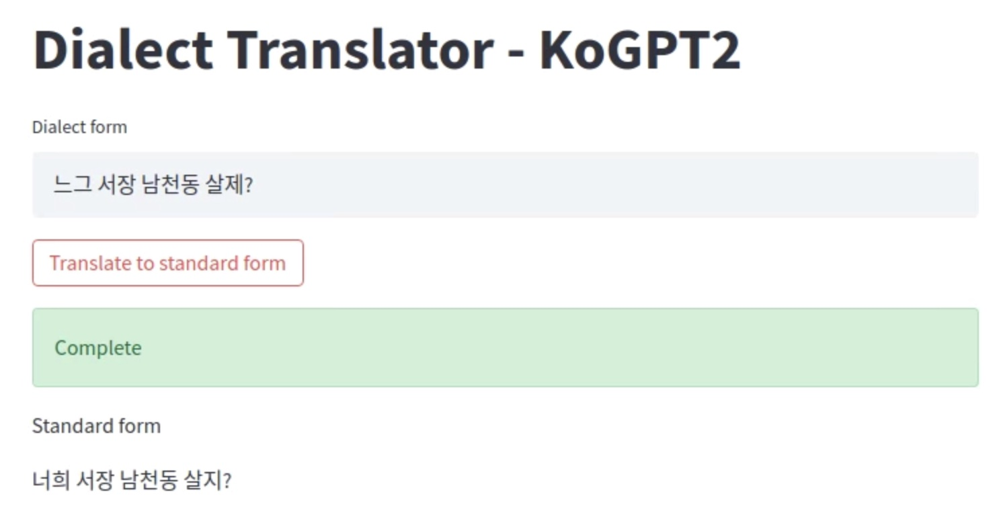

# KoGPT2 Finetune Example  (Dialect to Standard)
[SKT KoGPT2](https://github.com/SKT-AI/KoGPT2) 모델을 fine-tuning하여 사투리를 표준어로 변환하도록 학습

## Install requirements
```bash
pip install -r requirements.txt
```

## Dataset
[AI Hub 한국어 방언 발화(경상도)](https://aihub.or.kr/aidata/33981) 데이터셋의 텍스트 어노테이션만을 이용

### Input data structure
|index|standard|dialect|
|:---:|:---:|:---:|
|0|겉절이 나오고 그~|재래기 나오고 그~|
|1|저 고기 뭉치랑 먹으면은|저 고기 뭉탱이랑 먹으면은|
|2|놀러 가고 싶으면 어쩔려고|놀러 가고 싶으면 우얄라고|

## Training

dialect_translator/config.py  
train_path, test_path 변경

```bash
python main.py --train
```

Resume training from previous checkpoint
```bash
python main.py --train --checkpoint /path/to/checkpoint
```

Train with wandb logger
```bash
python main.py --train --wandb --project $PROJECT_NAME --entity $WANDB_ENTITY --name $EXPERIMENT_NAME
```

## Translator demo example
run_fastapi.py 체크포인트 경로 변경

```bash
./run.sh
```

http://127.0.0.1:8501 접속



## References
[1] [SKT-AI KoGPT2](https://github.com/SKT-AI/KoGPT2)  
[2] [KoGPT2-chatbot](https://github.com/haven-jeon/KoGPT2-chatbot)  
[3] [AI Hub](https://aihub.or.kr/)